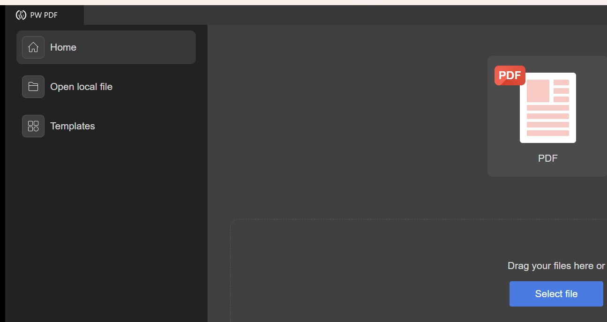
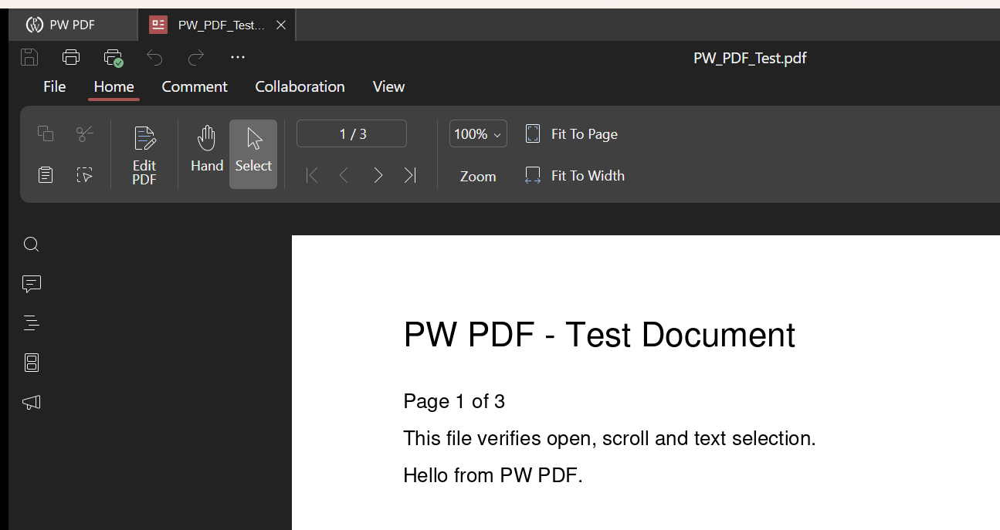

# PW PDF

Standalone PDF editor for Windows — a focused fork of ONLYOFFICE Desktop Editors
(release/v9.4.0) with everything except the PDF editor removed.



## Features

- Open and view PDF files (plus DJVU, XPS, OXPS in view mode)
- Text select, copy, and search
- Annotations: highlight, underline, strikeout, sticky notes, freehand draw, shapes
- Edit PDF text and insert images
- PDF forms: fill, save, and design form fields
- Page management: add, delete, rotate, reorder
- Print and save as PDF
- Templates gallery with PDF templates only
- "New PDF" creation from the start screen

Anything that is not a PDF, DJVU, XPS or OXPS file is refused with a message
before a tab opens, whichever way it is opened — command line, file
association, drag & drop, the file dialog or the recent list.

## What was removed from the fork

- Document, Spreadsheet, Presentation, and Visio editors (UI + build targets)
- Non-PDF templates and file-type support (open dialogs and open guard are PDF-family only)
- `sdkjs/slide`, `sdkjs/visio`, and all of `sdkjs/cell` except the 9 formula-engine
  files the word/pdf bundle requires (PDF form calculations)

The word engine (`sdkjs/word`) is retained by design — ONLYOFFICE's PDF editor is built
on it (text rendering, annotations, form filling). See `PHASE2_ANALYSIS.md` for the
dependency mapping that drove these decisions.

## Repository layout

Monorepo containing all forked ONLYOFFICE components at release/v9.4.0
(provenance and exact upstream commits in `VERSIONS.md`):

| Folder | Purpose |
|---|---|
| core/ | C++ engine: x2t converter, PDF reader/writer, fonts, rendering |
| sdkjs/ | JS editor engine (word bundle carries the PDF editor) |
| sdkjs-forms/ | Forms addon (required by the desktop build) |
| web-apps/ | PDF editor UI (`apps/pdfeditor`) |
| desktop-apps/ | Qt/C++ desktop shell + start page |
| desktop-sdk/ | CEF (Chromium) wrapper |
| build_tools/ | Build system |
| dictionaries/ | Spell-check dictionaries |
| document-templates/ | Blank `new.pdf` used by "New PDF" |

## Building (Windows)

Prerequisites: Python 3.11+, Node.js + grunt-cli, Java, Visual Studio 2022 build tools,
Qt 6.x (msvc2022_64 kit).

```
cd build_tools
python configure.py --module desktop --platform win_64 --update 0 --qt-dir "C:/Qt/6.11.1" --vs-version 2022
python make.py
```

Installer: `pwpdf_setup.iss` (Inno Setup 6).



## Install

Download `PW-PDF-Setup-1.0.0-x64.exe` from the
[releases page](https://github.com/RaviSoni804426/PW-PDF/releases) and run it.
It installs to `C:\Program Files\PW PDF`, adds Desktop and Start Menu shortcuts
(including a "New PDF" entry), and registers PW PDF as an option for `.pdf`,
`.djvu`, `.xps` and `.oxps`. Making it the default handler for a type is left
to Windows' own "Open with → Choose another app" so an existing PDF reader is
not hijacked.

## System requirements

- Windows 10/11 (64-bit), 4 GB RAM, ~1 GB disk

## License

AGPL v3 — inherited from ONLYOFFICE (© Ascensio System SIA).
PW PDF branding © Physics Wallah.
